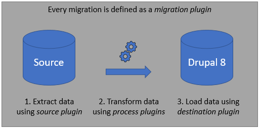
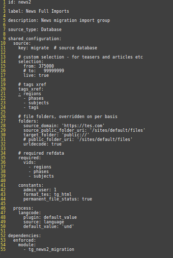
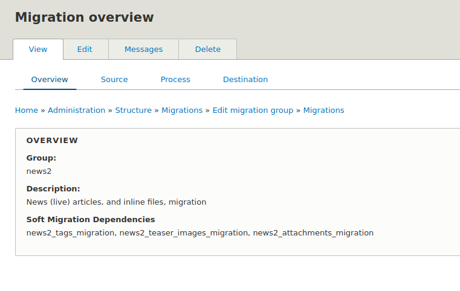
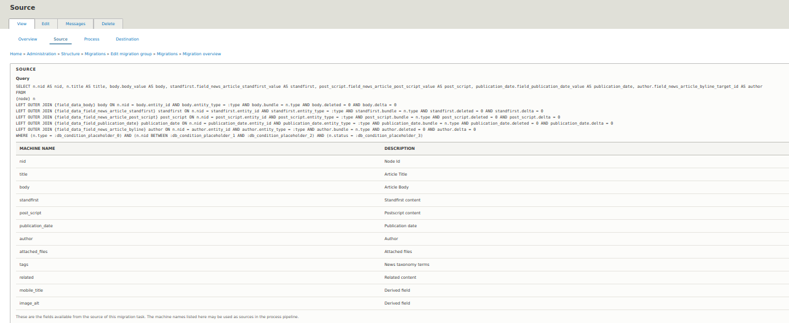
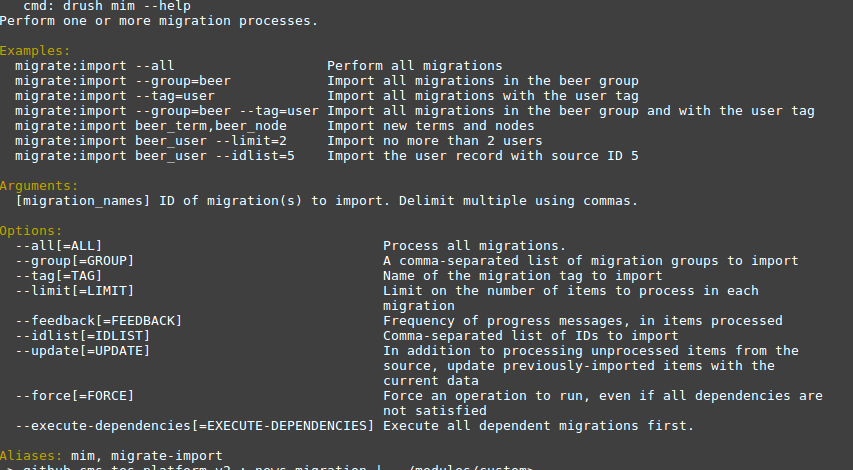
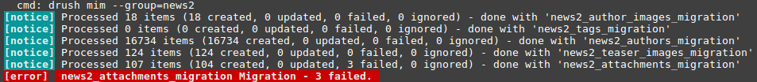

# Tes - Custom Drupal 8 Migration


## About me
* Drupal developer ("Software Engineer")

* Working at Tes for about 2.5 years.

* Working with Drupal for about 5 years.

* Mainly working in D7 although I did have a year of D6 (never want go back to that)

* Recently started working with D8.


## About Tes
* Foremost education news site for teachers and school leaders 

* World's longest running education magazine

* Nearly 8M registered users

* Dynamic global marketplace for education resources 

* UK Teaching recruitment services provider

* See [https://www.tes.com/](http://tes.com) and [https://www.tes.com/about](http://tes.com/about)


## What's this presentation about?
So, I kind of didn't know what to call this presentation the sort of ideas I had were: _"first tentative steps into D8 migration", "a beginner's guide to Drupal 8 migrations", "my migration headaches"_ ... but I ended up with the catchy title above.

So, what this presentation is:

* a migration outline strategy - live & test

* discussion of some different migration sources

* example code - config & custom plugins

* some of the issues along the way


## Extract, Transform, Load processes


As part of this presentation we will be looking at:

* Source plugins (extract phase)

* Process plugins (transform phase)

* Destination plugins (load phase)


## Module dependencies
Modules required include:

* migrate (core)

* migrate_plus (contrib)

* migrate_tools (contrib)

* source **SQLBase** migration type part of the core migrate soure plugins

* if non-sql data source then various contrib modules available to (e.g. migrate_source_csv)

* migrate_plus includes example migration modules

* migrate_tools gives us the UI and some useful drush utilities


## Background to the migration
* Existing D7 site

* 250K+ nodes (215K+ are news_articles)

* 16K+ authors

* 55K+ managed files

* Proposed redesign of news part of site

* Want to move to D8 and the redesign provides the rationale for that

* Still a _work in progress_


## Data analysis
* Before starting coding look at existing data

* Is it worth migrating?

* Automated vs manual migration?

* Manual migration has benefits => user familiarity, focus on whats important (less likely to ask for unnecessary content if they have to enter it)

* Talk to existing users (editors) - get feedback about what works, what doesn't, any content ambiguity

* Drives migration strategy, helps build target content types etc


## Test - CSV migration
* Need test content for themers (so need a sample migration for dev)

* Export => CSV extracts (via views and custom code)

* Import => using source CSV, `BaseCSV` class (migrate_source_csv contrib)


## Source Content 
* Taxonomy terms - various "News Article" vocabularies

* Author nodes (node.type = byline), minimal details

* News article nodes (node.type = news_article), more complex content

* Managed (and unmanaged) files - teaser/hero images, attachments, author photos, embedded media

* Data analysis & feedback helped decisions on what to migrate
(e.g. ambiguous fields removed -> teaser vs hero image) 

* News article target content type simplified
 
 
 ## Source "News Article" content type


## Target "News Article" content type


## Defining database connection 
Settings file (settings.local.php) entry

```php
$databases['migrate']['default'] = array (
  'database' => 'tes_cms',
  'username' => 'xxxx',
  'password' => 'xxxxxxxxx',
  'prefix' => '',
  'host' => 'hostname'
  'port' => '3306',
  'namespace' => 'Drupal\\Core\\Database\\Driver\\mysql',
  'driver' => 'mysql',
);
```

Define **source:key:connection-name** in config
 
```yaml
  source:
    key: migrate  # source database connection
```


## Migration group "news2"
* File `migrate_plus.migration_group.news2.yml`

* Group related migrations together

* Define **shared** configuration

* Define shared **constants**

* Run migrations as a group `drush mim --group=news2`

* Use migrate UI
 



## Taxonomy term mapping
* Pre-populated several vocabularies 

* regions, phases, subjects will be used along with tags to provide News Article tagging

* Pulling in 3 taxonomy fields from source to a single field on new content type

* Source field_news_article_tags, field_news_category, and field_news_section

* If it exists in regions, phases, or subjects then term not migrated

* Migration requirement -> certain vocabularies populated,  **checkRequirements()**


## Author images, attachments, teaser (or hero) images
* Create file entities for these

* Use core destination plugin `entity:file`

* Want to select target folder for each file source

* Want to "niceify" source file names (remove spaces, uppercase etc)

* Choose single image from teaser or hero fields


## Authors
* Create node for each author (node.type = "author") 

* Use core destination plugin `entity:node`

* Use `migration_lookup` plugin to map image field to file entity

* **no_stub: true** - dont create stubs for missing file entities

* Optional dependency - author images migrated first


## News articles
* Create node for each published news article (node.type = "news_article)

* Destination plugin `entity:node`

* Use `migration_lookup` for category, teaser image, and attachments

* Use `migration_lookup` (to current migration) with **no_stub:false** to create related content link

* Stub entries will be replaced when converted

* Optional migration dependency on tags, teasers, authors and attachments

* Embedded (inline) files and media downloaded as unmanaged file to target folder

* Existing (site) body images repointed to absolute uri's

* Embedded media tags converted to &lt;img&gt; tags  


## Migration UI
* provided by migration_tools module

* migration groups page

* migration group overview page

* individual migration execute page

* individual migration overview, source, process & destination pages

### Migration groups page


### Migration group overview page
* displayed in label (title) order, not in migration dependency order


### Migration ID Execute page
* Operations - import, rollback, stop, reset

* Update checkbox

* Ignore dependencies checkbox


### Migration ID Overview page



### Migration ID Source page



### Migration ID Process page


### Migration ID Destination page


## Source Plugins
* separate source plugin for each migration

* d7_news_files migration used for multiple file type migrations, just config (selection & target folder) different

* source plugin classes are extending migrate's `SqlBase` or `File` classes 

* source plugins will generally implement: **query()**, **fields()**, and **prepareRow()** methods

* we are also implementing **checkRequirements()**

* source data transformation (and possible rejection - `return FALSE`) is done in **prepareRow()** 

For details on the use source plugins have a look at https://www.drupal.org/docs/8/api/migrate-api/migrate-source-plugins/overview-of-migrate-source-plugins


## Process Plugins
* minimal use of process plugins

* source plugins have already transformed much of the data (see earlier)

* core process plugins make our life easier

* use "out of the box" functionality wherever possible

* only one custom process plugin **d7_file_download**

|Core or Custom|Name|Notes|
| --- | --- | :--- |
| Core | callback | We used this one in the authors node title (just to run a _ucwords_ against the supplied Author Title field) |
| Core | download | File download plugin - creates the target uri to our files (guzzle get) |
| Core | default_value | Supply a default value for a field process, e.g. content type field in News or Authors |
| Core | skip_on_empty | Skip process (or skip row) in a field process |
| Core | explode | Turn a delimited string into an array, thereby allowing a 1:M field explosion (e.g. news tags) |
| Core | migration_lookup | Standard mechanism of mapping entity ids (xref for entities created in other migrations or maybe even in this migration) |
| Custom | d7_news_file_download | A custom file download (extends core Download) allowing for revised guzzle options. |

For more on the core process plugins see https://www.drupal.org/docs/8/api/migrate-api/migrate-process-plugins/list-of-core-process-plugins


### Custom process plugin: d7_news_file_download
* Extending existing migrate `Download` class

* Provides ability to override default `guzzle_options`


### Show me the code
```php
namespace Drupal\tg_news2_migration\Plugin\migrate\process;

use Drupal\Core\File\FileSystemInterface;
use Drupal\migrate\Plugin\migrate\process\Download;
use GuzzleHttp\Client;

/**
 * @see Core Download process plugin for more details.
 *
 * Example:
 *
 * @code
 * process:
 *    plugin: d7_news_file_download
 *    source:
 *      - source_url
 *      - destination_uri
 *    guzzle:
 *      # ability to override guzzle options
 *      timeout: 60  # default is 30
 *
 * @MigrateProcessPlugin(
 *   id = "d7_news_file_download"
 * )
 */
class D7NewsFileDownload extends Download {

  /**
   * {@inheritdoc}
   */
  public function __construct(array $configuration, $plugin_id, array $plugin_definition, FileSystemInterface $file_system, Client $http_client) {
    if (isset($this->configuration['guzzle']) && is_array($this->configuration['guzzle'])) {
      foreach ($this->configuration['guzzle'] as $option => $value) {
        // overwrite any existing config option
        $configuration['guzzle_options'][$option] = $value;
      }
    }
    parent::__construct($configuration, $plugin_id, $plugin_definition, $file_system, $http_client);
  }
}
```  


## Destination Plugins
* This migration is using no custom destination plugins

* All "out of the box"

* `entity:file`

* `entity:taxonomy_term`

* `entity:node`

* Possibly `entity:user` if we decide to migrate users

For more on destination plugins have a look at https://www.drupal.org/docs/8/api/migrate-api/migrate-destination-plugins-examples


## Useful drush commands
* Provided by migrate_tools module

* migrate-status (ms) 

* migrate-import (mim)

* migrate-rollback (mr)

* migrate-stop (mst)

* migrate-reset-status (mrs)

* migrate-message (mmsg)

* most useful: **migrate-status**, **migrate-import**, **migrate-reset-status**

* use `--help` option to find out more


### drush migrate-status (ms)
* `drush ms --group=news2`

* same information as displayed in UI

* but, displayed in migration dependency order


### drush migrate-import (mim)
```
# run all migrations in named group (in dependency order)
drush mim --group=news2

# will run just the migraton IDs listed - unprocessed items only
drush mim news2_tags_migration,news2_authors_migration

# run the named migration with update flag
drush mim news2_tags_migration --update
```

Options available:




### drush migrate-reset-status (mrs)
* useful if your migration has failed and is left in a non "Idle" status.

```
drush mrs news2_articles_migration
```


## Dealing with migration errors
* strategy is to code around them (from our testing)

* however errors will occur



* because run via drush, optional dependencies honoured and migration stop at failure

* in this case errors were visible in migrate_map_[ID] table 

```
source_ids_hash: 6de7e724dab38c14560a1ab7e3d64573654d0791c2db6836d152a558a66df2c1
sourceid1: 87142
destid1: null 	
source_row_status: 3
rollback_action: 0
last_imported: 0
hash: null
```

* also available in migrate messages table

> msgid: 1
  source_ids_hash: 6de7e724dab38c14560a1ab7e3d64573654d0791c2db6836d152a558a66df2c1
  level: 1
  message: cURL error 28: Operation timed out after 29998 milliseconds with 57946981 out of 64995621 bytes received (see ...)
  
* can run a partial import `drush mim news2_attachments_migration --idlist="87142,87421,87394" --update`

* may need to remove error entries from map table first

```sql
DELETE FROM migrate_map_news2_attachments_migration WHERE destid1 IS NULL AND source_row_status != 0; 
```


## Gotchas
* config changes only imported on install

* config left over after module uninstall - resolved by adding an **enforced dependency** to the migration config files

* loads of migration tables 

* unexpected warning messages when running `drush ms`

* errors and the (not so) white screen of death

* cryptic error messages

* for requirements exceptions look at the log 

* stub entry creation 

* redirect to install.php if non-existent source db


## migrate_plus "Beer Example"
* Very useful example

* Variety of entity creation methods - user, taxonomy_term, node

* Config setup 

* Migration groups

* Use of shared configuration and constants

* Use of migration dependencies

* Stub entity creation

* Custom migration plugins (source plugins)

* Use of (some of the) core process plugins - including: **callback**, **default_value**, **static_map**, **migration_lookup**

* Loads of in-code documentation 

See https://github.com/jigarius/drupal-migration-example for an example of a config only migration


## Useful links, in no specific order
* https://www.drupal.org/project/migrate_plus

* https://www.drupal.org/docs/8/api/migrate-api/migrate-api-overview

* https://www.drupal.org/project/migrate/issues/2728233

* https://github.com/jigarius/drupal-migration-example

* https://agencychief.com/blog/drupal-8-csv-migration

* https://github.com/wunderio/migrate_source_example

* https://evolvingweb.ca/blog/drupal-8-migration-migrating-basic-data-part-1

* https://deninet.com/blog/2017/06/07/building-custom-migration-drupal-8-part-3-users-and-roles

* https://www.colorado.edu/webcentral/2017/04/04/writing-node-migrations-drupal-7-drupal-8

* https://www.sitepoint.com/your-first-drupal-8-migration/

* https://www.metaltoad.com/blog/drupal-8-migrations-part-3-migrating-taxonomies-drupal-7

* https://www.metaltoad.com/blog/drupal-8-migrations-part-4-migrating-nodes-drupal-7

* https://www.drupaleasy.com/blogs/ultimike/2016/04/drupal-6-drupal-81x-custom-content-migration