# Tes - Custom Drupal 8 Migration


This is the full notes related to the Drupal Camp London 2018 presentation about the custom D8 migration we're doing at Tes.

See also [presentation slides](https://garypigott39.github.io/tes-custom-d8-migration-reveal-js-presentation/), the [drupal 8 migration source code](../d8-modules/) and [drupal 7 extract custom code](../d7-modules)


## About Tes
* Foremost education news site for teachers and school leaders 

* World's longest running education magazine

* Nearly 8M registered users

* Dynamic global marketplace for education resources 

* UK Teaching recruitment services provider

* See [https://www.tes.com/](http://tes.com) and [https://www.tes.com/about](http://tes.com/about)


## What's this about?
So, I kind of didn't know what to call this presentation the sort of ideas I had were: _"first tentative steps into D8 migration", "a beginner's guide to Drupal 8 migrations", "my migration headaches"_ ... but I ended up with the catchy title above.

So, what this presentation is:

* a migration outline strategy - live & test

* discussion of some different migration sources

* example code - config & custom plugins

* some of the issues along the way

What it isn't:

* an exact "how to do D8 migrations" from a D8 expert


## Migrations - Extract, Transform, Load processes
Image courtesy of drupal migrate docs.


As part of this presentation we will be looking at:

* source plugins (extract phase)

* process plugins (transform phase)

* destination plugins (load phase)


## Background to the migration
* Existing D7 site

* 250K+ nodes (215K+ are news_articles)

* 16K+ authors

* 55K+ managed files

* Proposed redesign of news part of site

* Want to move to D8 and the redesign provides the rationale for that (plus other D8 arguments like better editing experience, better integration with APIs etc)

The proposed strategy is that we migrate our current News articles to a new D8 site and continue to serve other content (e.g. landing pages etc) from the old D7 site until such time as that is also migrated to D8.


## Module dependencies
Our custom migration is dependent on the following modules:

* migrate (Core)
* migrate_plus (Contrib)
* migrate_tools (Contrib)

The source **SQLBase** migration type is already part of the Core migrate source plugins so no other migration source modules are required.

If we wanted to pull from a non-sql data source then there are various contrib modules available to enable this, e.g. Json, CSV etc.

The **migrate_plus** module gives us some additional source and process plugins as well as a couple of examples of migration modules (beer migration and a more advanced wine migration example). 

The **migrate_tools** module gives us all various drush utilities that are useful bits of the migration process, including:

* migrate-status (ms)
* migrate-import (mim)
* migrate-rollback (mr)
* migrate-stop (mst)
* migrate-reset-status (mrs)
* migrate-message (mmsg)
 
This module also provides the migration UI, which I've been using for managing the group migration process - although we could do the whole process via drush if required (and this will be what we do with the live migration).


## Data analysis
Before starting any actual code it's wise to do some form of analysis of the existing data to see what is actually worth migrating. 

For example suppose an existing content type includes gallery images but when you look at the data you find that field is hardly ever used, you can then make a decision as to whether it's worth including in the target content and may change your (parts of your) **migration strategy**. 
 
It might be easier to migrate some content "manually" rather than write a migration for it. Manual migration can have the added benefit of getting your content editor's acquainted with the new CMS, it can also help them focus on what's actually important (they may be less likely to ask for un-required content if they've got to manually input it).
 
Talk with existing users (content editors) to get feedback about what works, what doesn't, any ambiguity etc.
 
Doing this phase will help you build target content types, that and any pre-defined requirements (e.g. "must have a mobile version of the title").


## Migration problem
So there are 2 parts to our migration:

1. Getting sufficient realistic "test" content onto our site so that themers can do their magic

2. Doing the live migration


## The Test content
The strategy here was:

* Use CSV source for migration content (so need **migrate_source_csv** contrib module)

* On source db populate entity queue with N (100) news nids (<= 1 year old)

* Extract managed files for those articles (teaser images, attachments)

* Extract authors for those articles (node.type = 'byline')

* Extract all author images, as there werent many - view based CSV export

* Extract news articles (node.type = 'news_article') - view based CSV export

The entity queue population and file subset extract was done by a temporary module drush command's. The other bits by view CSV export (so we used the contrib module _views_data_export_).

Running the exports meant we would then end up with 5 CSV files containing all our test data:

1. tags.csv
2. author-images.csv
3. authors.csv
4. files.csv
5. articles.csv


## The Test Migration
We're not going to focus on the test CSV-based migration other than to say that:
 
* drush export commands, source code for that can be seen in [drush export temporary module](./d7-modules/tes_v2_data)
 
* these were supplemented by CSV export views 

* test source data is a collection of [CSV data export files](./d8-modules/tg_news_migration/data) 

* there is a [readme file](./d8-modules/tg_news_migration/data/README.md) which describes the extract source data

* helped to drive the logic for the live migration

The running of the test migration was handled by a composer script (defined in `composer.json` file) 

```
  "scripts": {
    ...,
    "import-news": [
      "cd web && drush en tg_news_migration -y && drush cr && drush migrate:import news_tags_migration,news_files_migration,news_author_images_migration,news_authors_migration,news_articles_migration && drush pm-uninstall tg_news_migration -y"
    ]
  },
```

And then run via a _composer run-script_ command in the test site creation.

```
composer run-script import-news
```


## Test Migration Group
Test CSV migration grouped under the migration group _news_


If you want to find out more about the test migration have a look at the [source code](./d8-modules/tg_news_migration)


## Source & Target Nodes
So the author migration was to be very minimal we just map the title, body (where there is one), and photo to a simple Author content type on the D8 site.


### Source News Content Type

The existing News Article content type has a fairly complex structure - after data analysis we can see that some of the fields are not really used, and from _user feedback_ we know that some of the content fields are ambiguous (e.g. having a hero & teaser image, has cause confusion in the past).


### Target News Article Content Type

The News Article content type is as you would expect more involved. The data structure has been simplified as follows:

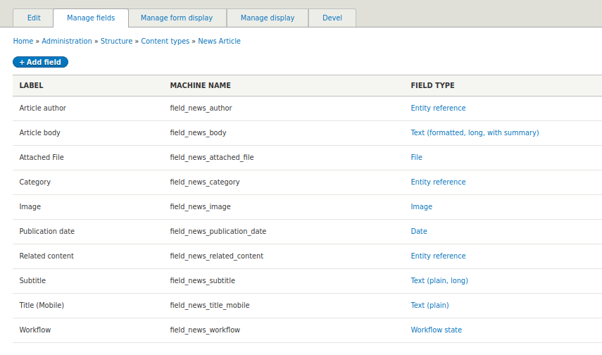


## Taxonomy Term Mapping
So, this was different to the test migration (as our strategy changed) in that we introduced additional taxonomy vocabularies and populate those (in a seperate migration) before this migration is run. 

Of those vocabularies we are using:
* regions
* phases
* subjects

And have specified that they must be populated (as a migration requirement, see **checkRequirements** method) in order to run said migration. Failure results in a **RequirementsException** being thrown so check the dblog.

In the source we then run a custom xref against these terms and only pass through the terms that dont already exist, and these are then used to populate the _tags) taxonomy.

Shared config (in `migrate_plus.migration_group.news2.yml`):

```yaml
shared_configuration:
  source:
    ...

    # tags xref
    tags_xref:
      - regions
      - phases
      - subjects
      - tags
    
    # required refdata
    required:
      vids:
        - regions
        - phases
        - subjects
```

Tags config file snippet:

```yaml
process:
  name: name

  description: description

  vid:
    plugin: default_value
    default_value: tags
```


## Author Images, News Attachments
So for author images and news attachment files we want to create a file-entity for each of these.  

```yaml
process:
  file_source: filepath

  file_dest: destination_file_path

  filename: filename

  uri:
      plugin: d7_news_file_download
      source:
        - '@file_source'
        - '@file_dest'
      guzzle:
        timeout: 60

  status: constants/permanent_file_status

  uid: constants/admin_user
```

As we want to create the files in a specific folder the file destination is created in the source plugin's **prepareRow** method but we will look at the custom plugins in more detail later.


## News Teaser Images
Just like the above, this migration creates file-entities for the News teaser (or hero) image field. The only difference is that the source of the file field is either teaser or hero image depending on which field exists and to this end the migration uses a differenct database query to the other file migrations.

More later when we look at the source plugins.


## Author Mapping
```yaml
process:
  title:
    -
      plugin: skip_on_empty
      source: nid
      method: row
    -
      plugin: callback
      callable: ucwords
      source: title

  field_author_description: body

  field_author_image/target_id:
    plugin: migration_lookup
    migration: news2_author_images_migration
    source: photo_fid
    no_stub: true  # if not found then dont create "stub"

  field_author_image/alt: image_alt

  type:
    plugin: default_value
    default_value: author

  uid: constants/admin_user

migration_dependencies:
  optional:
    - news2_author_images_migration  
```

So, these mappings are very straightforward the only complication is the author image field where the target id (file entity) is the one that is loaded in the author image migration. 

Here we use the **migration_lookup** process plugin to map the source file id to converted file entity. This also means that there is a migration dependency on the news author images being run (I set it as _optional_, but it could be _required_). 

Notice the use of the **callback** plugin to run the "ucwords" function on the author title. 


## News Article 
```yaml
process:
  title:
    -
      plugin: skip_on_empty
      source: nid
      method: row

    -
      plugin: callback
      callable: ucwords
      source: title

  # its expected that this is plain text already
  field_news_subtitle: standfirst

  field_news_body/value: body

#  field_news_body/summary: summary  # @todo: looks like we want plain text, will discuss with Scott

  field_news_body/format: constants/format_tes

  field_news_title_mobile: mobile_title  # @todo: tba - see prepare row

  field_news_publication_date: publication_date

  field_news_attached_file:
    -
      plugin: skip_on_empty
      method: process
      source: attached_files

    -
      plugin: explode
      delimiter: ', '

    -
      plugin: migration_lookup
      migration: news2_attachments_migration
      no_stub: true

  field_news_image/target_id:
    plugin: migration_lookup
    migration: news2_teaser_images_migration
    source: nid  # image is a 1:1 mapping, so have done it on NID
    no_stub: true

  field_news_image/alt: image_alt

  field_news_category:
    -
      plugin: skip_on_empty
      method: process

    -
      plugin: explode
      source: tags
      delimiter: ', '

# xref is now done in the source plugin "prepare row" bit
#    -
#      plugin: custom_migration_lookup
#      migration: news_tags_migration
#      no_stub: true  # if not found then dont create "stub"

  field_news_author:
    -
      plugin: skip_on_empty
      method: process
      source: author      
    -
      plugin: explode
      delimiter: ', '
    -
      plugin: migration_lookup
      migration: news2_authors_migration
      no_stub: true  # if not found then dont create "stub"

  field_news_related_content:
    -
      plugin: skip_on_empty
      method: process
      source: related
    -
      plugin: explode
      delimiter: ', '
    -
      plugin: migration_lookup
      migration: news2_articles_migration
      # no_stub: defaults to false, as its based on the current migration we do want to create a stub for re-population

#  field_news_workflow: @todo

  type:
    plugin: default_value
    default_value: news_article

  # @todo: use actual user once users extracted - tba?
  uid: constants/admin_user

migration_dependencies:
  optional:
    - news2_tags_migration
    - news2_teaser_images_migration
    - news2_attachments_migration

```

As you would expect this is the more complex of the mappings, but again they are straightforward. 
 
Notice the use of _migration_lookup_ for category (tags), news image (teaser image), and author fields. So, again we have dependencies on previous migrations, and we have specified  `no_stub: true` which means we wont create a dummy (stub) entity for lookups that aren't found.

But notice also the related content field, this is using a lookup on the current migration. Notice that in that instance we do want to create stub entries so haven't used the no_stub flag, this will then create "stub" news article nodes when no found and as that key (see source key) is converted it will then replace the stub entry.

Just as we did for authors, notice the use of the shared configuartion **constant** for the _uid_ field. 

Had we been populating users then we could create a corresponding user entity and then use the migration_lookup mechanism mentioned earlier.

_Another aspect to this bit of the migration is the downloading of inline files and body content editing to remap the source to the new downloaded file (more on this later)._


## Defining a database connection
So for the live migration we are using a database connection to retrieve our source data (unlike the test migration which used csv files). 

We define the connection in our migration file using the `source:key:connection-name`
 
```yaml
  source:
    key: news_migrate  # source database connection
```

and in out **settings.local.php** file

```php
// dont use "migrate" as this is the default migration connection name
// and results in automatic creation of D6/D7 migrations and resultant
// mapping tables etc
//
//$databases['migrate']['default'] = array (
//
$databases['news_migrate']['default'] = array (
  'database' => 'tes_cms',
  'username' => 'xxxx',
  'password' => 'xxxxxxxxx',
  'prefix' => '',
  'host' => 'hostname'
  'port' => '3306',
  'namespace' => 'Drupal\\Core\\Database\\Driver\\mysql',
  'driver' => 'mysql',
);
```


## Grouping migrations and shared config
A useful technique is to group migrations so that you can:

* define shared configuration

* run the migrations as a group (and see migrate status for the group) 

* use the migrate UI

**Config - migrate_plus.migration_group.news2.yml**

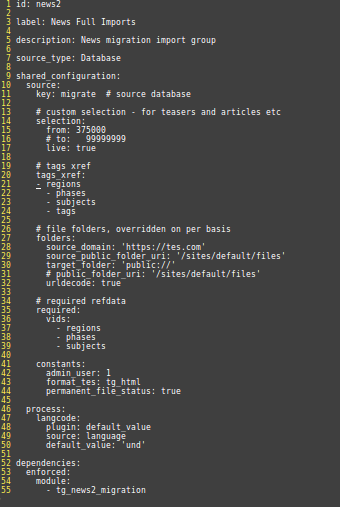


**Group status - via drush**


## Migration dependencies
This is where you can define dependencies between migrations. This would be defined in the individual migration config files, e.g. the news_article_migration (`news_article_migration.yml`) uses entities that are loaded in other migrations so is dependent on those migrations.

```yaml
migration_dependencies:
  optional:
    - news2_tags_migration
    - news2_authors_migration
    - news2_teaser_images_migration
    - news2_attachments_migration
```

These have been specified as optional dependencies, which means that we can run this migration manually without the specified migrations having been run. 

However if we wanted we could make those **required** dependencies, then if running via drush you would get an error message like:

>  [error]  Migration news2_articles_migration did not meet the requirements. Missing migrations news2_attachments_migration, news2_tags_migration, ... 

_Running via the UI has the effect of running dependent migrations first._


Note, that some of these actually failed due to their own requirements (see source class method **checkRequirements**).


## Migration UI
Provided by the _migration_tools_ module - for my test migrates this was the prefered way of running the migrations.

**Migration Group Page**


**News2 Group Overview Page**

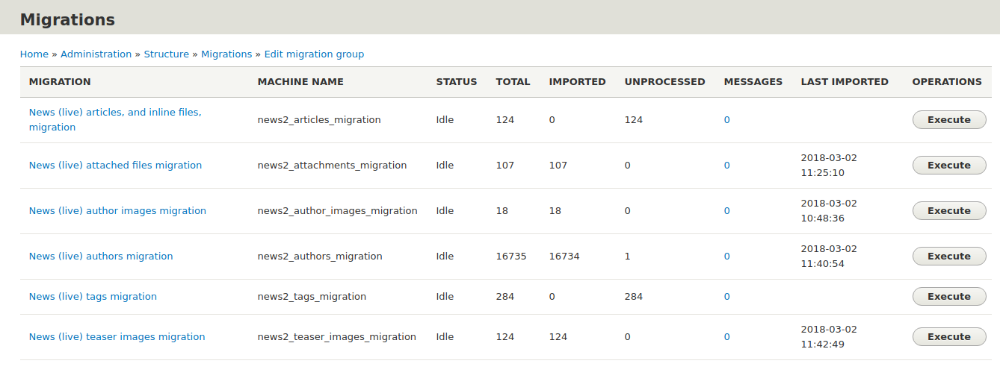

Note that the migration UI displays the migrations in title (label) order, **not** in migration dependency order (unlike `drush ms`).

If you wanted to show them in order then you could add a step prefix, e.g. "1 - News tags", etc

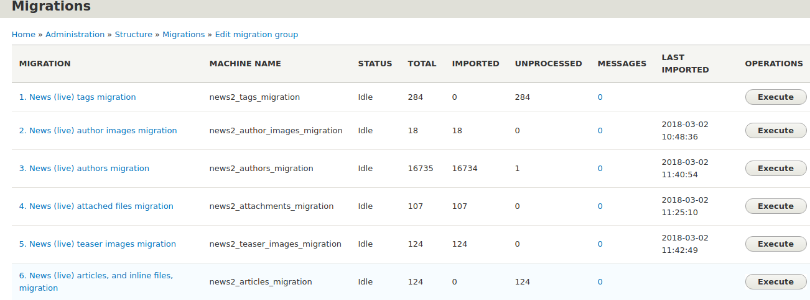

Also, the names and id's could be abbreviated if required (no need to include "_migration" in the id).

Clicking on the messages link (or _Migration overview_ link in migration execute page) then gives access to see the migration overview (_Overview, Source, Process, Destination_).

**News articles overview**

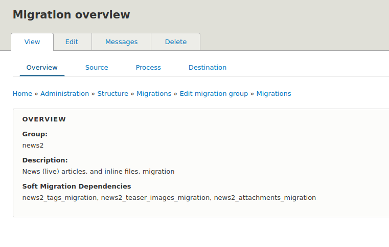

**News articles source**

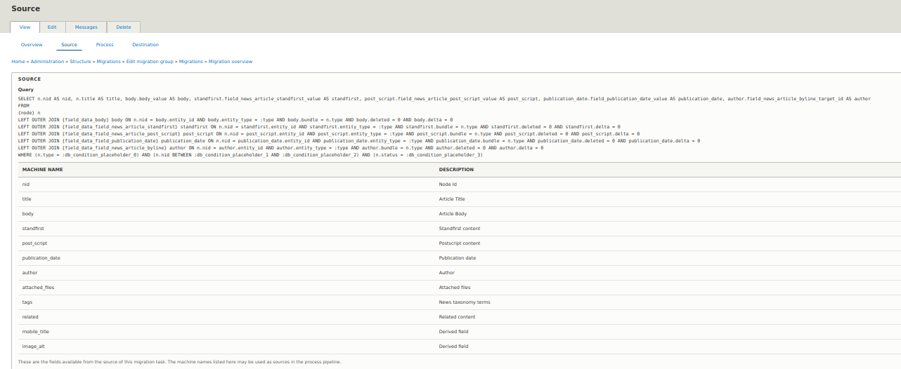

**News articles process**


**News attached files source**

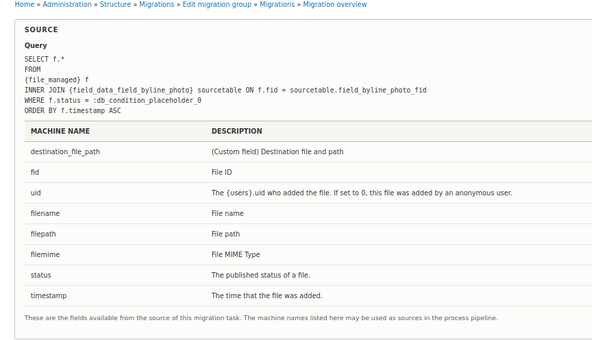


## Source plugins
We have created a source plugin for each of the migrations (although we are reusing the _d7_news_files_ one for images and attachments), in each we are extending either the migrate **SqlBase** or **File** classes.

* **d7_news_tags** - extracts taxonomy terms from the source database. The prepareRow method is used to check if the term already exists in one of the other (pre-populated) taxonomies and if it does then the row is rejected.

* **d7_news_files** - extends the `Drupal\file\Plugin\migrate\source\d7\File` class and is used to extract entries from the source managed files table for a supplied source table type, e.g. 

```yaml
# snippet from author images config, same mechanism used for attachments
source:
  plugin: d7_news_files
  
  source_sql:
    table: field_data_field_byline_photo
    field: field_byline_photo_fid
    live: true
    
  folders:
    target_folder: 'public://author-images'      
```

* **d7_news_teasers** - extends the `D7NewsFiles` class and is used to extract the news article teaser images. The only difference is that the query uses a nid selection range to determine which files to extract and has to choose between either a teaser image or hero image source field. As we only extract a single image per node, the **nid** is used as the image key field.

* **d7_authors** - the authors migration plugin, this migration is _dependant_ on the author image migration having been completed first (defined in config).

* **d7_news_articles** - like the news teasers, it uses a nid selection range to determine which articles to extract. This migration builds on and is dependant in the previous parts of the migration process and so would normally occur last. Here the bulk of the logic is in the prepareRow method and part of that is processing of inline (body content) embedded files which are downloaded to a named target folder. Embedded **media images** are converted to the corresponding image tag and also downloaded (saved as unmanaged files).
  
For details on these have a look at the [module source code](./d8-modules/tg_news2_migration) and also https://www.drupal.org/docs/8/api/migrate-api/migrate-source-plugins/overview-of-migrate-source-plugins


## Process plugins
Unlike the CSV migration this time we have only used a few process plugins, and only one custom process plugin, prefering to _transform_ the data in the source phase of the migration (in the source plugin's **prepareRow** method).

The Core process plugins are there to make our life easier, and (following the mantra that its better to use _"out of the box" functionality wherever possible) we have used several of them in this migration, including:


|Core or Custom|Name|Notes|
| --- | --- | :--- |
| Core | callback | We used this one in the authors node title (just to run a _ucwords_ against the supplied Author Title field) |
| Core | download | File download plugin - creates the target uri to our files (guzzle get) |
| Core | default_value | Supply a default value for a field process, e.g. content type field in News or Authors |
| Core | skip_on_empty | Skip process (or skip row) in a field process |
| Core | explode | Turn a delimited string into an array, thereby allowing a 1:M field explosion (e.g. news tags) |
| Core | migration_lookup | Standard mechanism of mapping entity ids (xref for entities created in other migrations or maybe even in this migration) |
| Custom | d7_news_file_download | A custom file download (extends core Download) allowing for revised guzzle options. |
| Customm | d7_stub_name | Allows for a nicer format stub name. |

For more on the Core process plugins have a look at https://www.drupal.org/docs/8/api/migrate-api/migrate-process-plugins/list-of-core-process-plugins


## Process plugin - d7_news_file_download
This is the only process plugin in the tg_news2_migration module, here we are just extending the existing Download class to add the ability to override the default `guzzle_options`.

```php
namespace Drupal\tg_news2_migration\Plugin\migrate\process;

use Drupal\Core\File\FileSystemInterface;
use Drupal\migrate\Plugin\migrate\process\Download;
use GuzzleHttp\Client;

/**
 * @see Core Download process plugin for more details.
 *
 * Example:
 *
 * @code
 * process:
 *    plugin: d7_news_file_download
 *    source:
 *      - source_url
 *      - destination_uri
 *    guzzle:
 *      # ability to override guzzle options
 *      timeout: 60  # default is 30
 *
 * @MigrateProcessPlugin(
 *   id = "d7_news_file_download"
 * )
 */
class D7NewsFileDownload extends Download {

  /**
   * {@inheritdoc}
   */
  public function __construct(array $configuration, $plugin_id, array $plugin_definition, FileSystemInterface $file_system, Client $http_client) {
    if (isset($configuration['guzzle']) && is_array($configuration['guzzle'])) {
      foreach ($configuration['guzzle'] as $option => $value) {
        // overwrite any existing config option
        $configuration['guzzle_options'][$option] = $value;
      }
    }

    parent::__construct($configuration, $plugin_id, $plugin_definition, $file_system, $http_client);
  }
```


## CSV migration - process plugins
In the _CSV migration_ we did much more of our field manipulation in the process functionality and so we used more process plugins, including the following **custom** plugins:

* choose_value
* nice_file_name
* source_path_name
* trim_chars
* custom_migration_lookup
* news_file_download

If you want to see any of these have a look at the [csv migration module](./d8-modules/tg_news_migration) code.


## Destination plugins
This migration has no custom destination plugins, instead it makes use of the following _"out of the box"_ destination plugins:

* entity:file

* entity:node

* entity:taxonomy_term

If we ever migrate our users then we would also use the `entity:user` plugin.

For more details on core destination plugins have a look at https://www.drupal.org/docs/8/api/migrate-api/migrate-destination-plugins-examples


## What no_stub?
Or, _"to stub or Not to stub"_ that is the question...

You will notice when looking at the **process** parts of the config YML files that for _entity fields_ which are migration based, i.e. using results from other parts of the migration via _migration_lookup_, that the **no_stub** config argument is set to true, e.g. authors migration `migrate_plus.migration.news2_authors.yml` file.

```yaml
  field_author_image/target_id:
    plugin: migration_lookup
    migration: news2_author_images_migration
    source: photo_fid
    no_stub: true  # if not found then dont create "stub"
```

What this means is that if the migration fails to find a corresponding entry in the named migration map table then a "stub" entry will **not** be created for that entity.


### Default is "no_stub: false"
**no_stub: false** is the default config setting for the _migration_lookup_ plugin. 

So, in the case of the above if set to _false_ (or just not specified) it would mean that when no mapping was found a dummy (**stub**) file entity would be created for source file entity with details gleaned from the source migration.

Ultimately stub entries are replaced with real data when the named source migration is run and loads an entity for the named stub id. 

In our migration as we have (supposedly) run all the dependent migrations first then all dependent entities should already exist so we don't need to create stubs.

The exception to the above is the **related content** on the news article, as this field is based on the news articles migration (so points to itself), see `migrate_plus.migration.news2_articles_migration.yml` file.

```yaml
  field_news_related_content:
    -
      plugin: skip_on_empty
      method: process
      source: related

    -
      plugin: explode
      delimiter: ', '

    -
      plugin: migration_lookup
      migration: news2_articles_migration
      # no_stub: defaults to false, as its based on the current migration we do want to create a stub for re-population
```

Now, if we were also migrating users (which we aren't doing currently) then the **uid** field which is currently just set to be the (constant) _admin user_ could also be a stub field. So that once all the users were populated then the stubs would be filled with the appropriate user details.


## Drush commands
The **migrate_tools** module provides some useful drush commands, including:

* migrate-status (ms)

* migrate-import (mim)

* migrate-rollback (mr)

* migrate-stop (mst)

* migrate-reset-status (mrs)

* migrate-message (mmsg)
 
Now the ones I used most were **migrate-import**, **migrate-status** and **migrate-reset-status** 

To find out more about any of these run them with the `--help` option


### drush migrate-status (ms)
```
drush ms --group=news2
```


So, essentially the same information as provided by the UI.


### drush migrate-import (mim)
Some examples:
```
# run all migrations in named group (in dependency order)
drush mim --group=news2

# will run just the migraton IDs listed - unprocessed items only
drush mim news2_tags_migration,news2_authors_migration

# run the named migration with update flag
drush mim news2_tags_migration --update
```

Note there are various options available:

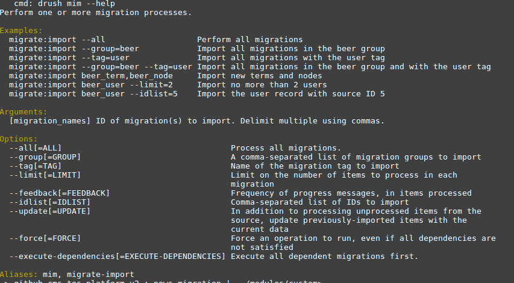


### drush migrate-reset-status (mrs)
Useful if your migration has failed and is left in a non "Idle" status.

```
drush mrs news2_articles_migration
```


## Dealing with migration errors
So our strategy is to try to code around them in our testing, however migration errors will occur just like the example shown below.


Now because we were running it in drush for the whole group, optional dependencies were honoured and the migration was run in the right order, but on the news attachments it failed to download 3 files due to a timeout. _This then caused the migration to stop._

These errors were visible in the migrate map table for the attachments 

**migrate_message_[id] table**

So, looking at this we can see the actual cause of the error, e.g. 

> msgid: 1
  source_ids_hash: 6de7e724dab38c14560a1ab7e3d64573654d0791c2db6836d152a558a66df2c1
  level: 1
  message: cURL error 28: Operation timed out after 29998 milliseconds with 57946981 out of 64995621 bytes received (see ...)

**migrate_map_[id] table**
And the mapping of the migration to a target id, where the migration has failed the destination id field will probably be blank and there will be a non-zero row status value, e.g. 

```
source_ids_hash: 6de7e724dab38c14560a1ab7e3d64573654d0791c2db6836d152a558a66df2c1
sourceid1: 87142
destid1: null 	
source_row_status: 3
rollback_action: 0
last_imported: 0
hash: null
```

Now, rather than re-running all of the migration as an update we should be able to just run those failed IDs again:

```
drush mim news2_attachments_migration --idlist="87142,87421,87394" --update
```

When I tried this it didn't actually work and I had to **delete** the invalid entries from the migration map table and then use the `--idlist`.

```sql
DELETE FROM migrate_map_news2_attachments_migration WHERE destid1 IS NULL AND source_row_status != 0; 
```


## Gotchas
These included:
* config changes only imported on install

* config left over after module uninstall - resolved by adding an **enforced dependency** to the migration config files (more later)

* loads of migration tables 

* unexpected warning messages when running `drush ms`

* errors and the (not so) white screen of death

* cryptic error messages

* for requirements exceptions look at the log 

* stub entry creation 

* redirect to install.php if non-existent source db


### Gotchas - config imported on install
Migration config

```sql
SELECT * FROM config WHERE name LIKE 'migrate%'
```


So, if you change the config files for revised mappings etc, they wont be automatically picked up. You can run a partial config import using:

```
drush config-import --partial --source=modules/custom/tg_news2_migration/config/install
```
 
But I found the easiest solution to reinstall the module 

```
drush pm-uninstall tg_news2_migration; drush en tg_news2_migration
```


### Gotchas - config left over
When working on the a new migration, uninstalling and resinstalling the module gave an error like 

> Configuration objects... already exist in active configuration

Now, the reason for this is that the configuration is not removed when the module is uninstalled, but re-installing it will then attempt to recreate said config and hence the error. 

So ideally what we want is to remove associated configuration when the module is uninstalled and the easiest way to do this is to make each config dependent on the named module, so in each of the config files you will see some **module dependencies**.

```yaml
dependencies:
  enforced:
    module:
      - tg_news2_migration
```

Alternatively you could add a **hook_uninstall** to your `module.install` file and then clear the migrations that way, for example:

```php
function my_module_uninstall() {
  db_query('DELETE FROM {config} WHERE name LIKE 'migrate_plus.migration.news2%');
  db_query('DELETE FROM {config} WHERE name LIKE 'migrate_plus.migration_group.news2%');
  drupal_flush_all_caches();
}
```

But to me it's just easier (and safer) to add that dependency.


### Gotchas - loads of migration tables
So enabling the migration module (specifically migrate_drupal) will create a number of **migration map** tables corresponding to the each of the migration ids. There will also be migration message tables etc. 

```sql
SELECT COUNT(*) FROM information_schema.tables 
WHERE table_schema = 'tes_cms_v2' 
AND table_name like 'migrate_%'

COUNT(*)
522
```

Various core (& contrib) modules may also create their own migrate map and message tables, lile _d7_node_, _d7_file_ etc.

**Node: migration templates** 

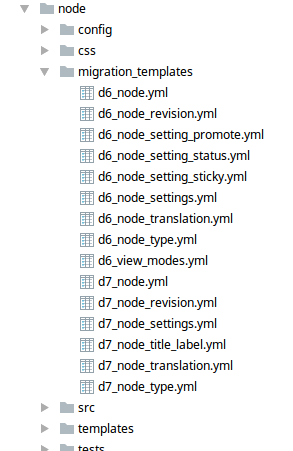

**Block: migration templates**


### Gotchas - unexpected warnings
So running `drush ms` gave me some unexpected messages.

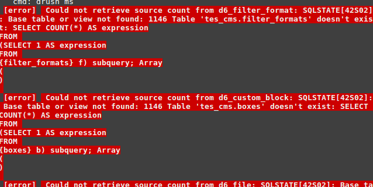

It's just that the corresponding source database D6 table does not exist in our migrate database "tes_cms" (see Database connection above).
 
 There errors come from the various D6 migrations defined "out of the box" (see "Gotchas: loads of migration tables" above). 

_For example the table "filter_formats" was replaced in D7 by the "filter_format" table (and our source database is Drupal 7)_. 


#### Fix for excessive migration tables & warning messages 
found the reason for this and it is due to the name of the database connection we were using. 

Basically _"migrate"_ is the default connection name for migrations and as such enabling the migrate module then used this connection to build a set of migrations for all the taxonomies and entities on the source migration database.

Changing the connection name to "news_migrate" means no more D6/D7 migration tables, as the module cant now find the source database from which to create these (entity) migrations.


### Gotchas - errors and white-screen
So migration UI errors can be a bit surprising initially.


This then needs to be followed up by a visit to the **dblog page** (_/admin/reports/dblog_) to try to find out the cause of the error. 

_As an aside - I found the viewing dblog messages difficult, and found it much easier to just hover over the error link as the message was easier to read_


### Gotchas - requirements exceptions
Now, in the requirements we have included the **checkRequirements()** method so that we pick up any pre-flight requirements and abandon this part of the migration if they are not met (e.g. taxonomy terms preloaded, valid file folders etc).

```php
  # code snippet from D7NewsTags class
  
  /**
   * {@inheritdoc}
   */
  public function checkRequirements() {
    parent::checkRequirements();
    if (!D7Utils::checkSourceDatabase($this->getDatabase())) {
      throw new RequirementsException('Unable to connect to source database, or tables missing');
    }
    elseif (isset($this->configuration['required']['vids'])) {
      // check that the source tags are populated
      if (!D7Utils::checkRefdataPopulated($this->configuration['required']['vids'])) {
        throw new RequirementsException('required:vids - refdata vocabularies are not populated');
      }
    }
  }
```

The migration error does not appear in the UI, instead it shows nothing migrated.


Instead you need to look at the dblog error messages.


To make this more obvious from the UI we could also include a `drupal_set_message` to include a warning about the exception, e.g.

```php
drupal_set_message('whatever - requirements error message', 'error', TRUE);
```

One way to do this could be to extend the `RequirementsException` class and just add the set_message to the constructor.


### Gotchas - cryptic messages
You may encounter errors in your migration
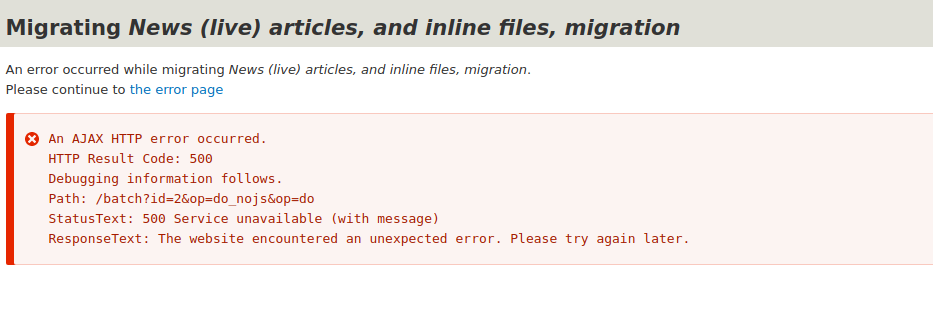

This is (hopefully) decyphered by a visit to the dblog page.


In this case it was because I had not specified the `use` namespaces for the FileSystemInterface and Client classes in the process plugin `D7NewsFileDownload` class.
  
    
### Gotchas - stub entry creation
So, I was getting some SQL Integrity errors ("title cannot be NULL") in my message table for the news articles part of the migration. 

I was tearing my hair out trying to work out what the issue was - particularly as all the source nodes I was expecting were being created.

Eventually I figured out that it was the stub entry creation that was giving me error. The problem lay in the process config that I was using for the title field:

```yaml
process:
  title:
    -
      plugin: skip_on_empty
      source: nid
      method: row

    -
      plugin: callback
      callable: ucwords
      source: title
```

Simplifying it to just map `title: title` resolved the issue, as it turned out I didnt need the other bits anyway (config inherited from the test csv version).

Now, the creation of stub entries may cause the **imported total to exceed** the calculated total and may also necessitate multiple runs of the migration, via the UI, there are no more source rows to process.


If you look at the corresponding migration map table you can identify the "stub" entries from the source_row_status


 
### Gotchas - redirect on invalid source db
I have included requirements checking in my **source plugins** to try to resolve connecting to the source db (ensure certain tables exist and are not empty).

If however the migration source points to a non-existent database then the inbuilt migration error trapping will actually result in a redirect to the target uri `domain/core/install.php`.


Not really an issue, but just a bit confusing when you're expecting to see the migrations UI overview.


## migrate_plus "Beer Example"
Have a look at the migrate_plus module's custom beer migration (migrate_example) this is extremely useful as it demonstrates:

* Variety of entity creation - user, taxonomy_term, node

* Config setup 

* Migration groups

* Use of shared configuration and constants

* Use of migration dependencies

* Stub entity creation

* Custom migration plugins (source plugins)

* Use of (some of the) core process plugins - including: **callback**, **default_value**, **static_map**, **migration_lookup**

* Loads of in-code documentation 

If you're interested in an example of a _config only_ migration have a look at [Drupal 8 Migration: Migrating Basic Data](https://evolvingweb.ca/blog/drupal-8-migration-migrating-basic-data-part-1) blogs and his [example code](https://github.com/jigarius/drupal-migration-example) 


## Useful Links
In no specific order:

* https://www.drupal.org/project/migrate_plus

* https://www.drupal.org/docs/8/api/migrate-api/migrate-api-overview

* https://www.drupal.org/project/migrate/issues/2728233

* https://github.com/jigarius/drupal-migration-example

* https://agencychief.com/blog/drupal-8-csv-migration

* https://github.com/wunderio/migrate_source_example

* https://evolvingweb.ca/blog/drupal-8-migration-migrating-basic-data-part-1

* https://deninet.com/blog/2017/06/07/building-custom-migration-drupal-8-part-3-users-and-roles

* https://www.colorado.edu/webcentral/2017/04/04/writing-node-migrations-drupal-7-drupal-8

* https://www.sitepoint.com/your-first-drupal-8-migration/

* https://www.metaltoad.com/blog/drupal-8-migrations-part-3-migrating-taxonomies-drupal-7

* https://www.metaltoad.com/blog/drupal-8-migrations-part-4-migrating-nodes-drupal-7

* https://www.drupaleasy.com/blogs/ultimike/2016/04/drupal-6-drupal-81x-custom-content-migration
